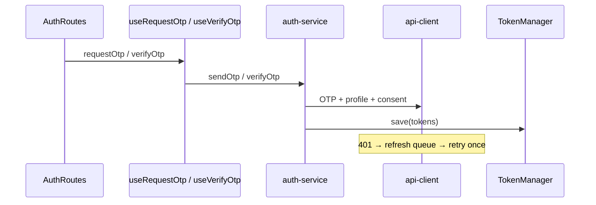

# API Implementation

**Single source of truth** for backend integration on the Autolokate QR PWA.  
Update this document when each phase completes — do not create separate report files.

**OpenAPI:** `https://malisa-noninclusive-davin.ngrok-free.dev/openapi.json`  
**Last updated:** QR attach (Phase 9) — June 2026

---

## Executive Summary

The QR PWA has a **locked UI** and a **layered integration architecture**. Authentication, purchase checkout, prepaid/B2B activation preview/redeem, and post-payment QR attach are production-ready. Most other domains still use mock data.

**Coverage:** 19 of ~35 consumer API operations integrated (**54%**).

**Next phase:** Emergency contacts (CRUD + OTP).

**Verdict:** Phase 9 (QR attach) complete. Purchase R10 headlessly binds the resolved QR code to the confirmed vehicle after payment success.

---

## Current Backend Status

| Domain | OpenAPI | Integrated | Notes |
|--------|:-------:|:----------:|-------|
| Auth OTP / refresh / logout | ✅ | ✅ | Production-ready |
| Consent grant | ✅ | ✅ | Fire-and-forget after verify |
| Legal documents | ✅ | Partial | Fetched for consent only; L1/L2 UI static |
| Profile GET | ✅ | ✅ | On verify |
| Profile PATCH | ✅ | ✅ | A3 vehicle-owner via `useUpdateProfile` |
| Device FCM | ✅ | ✅ | Headless; requires `setFcmTokenProvider` for live POST |
| Vahan lookup | ✅ | ✅ | Purchase R04 + PWA park-me via `useVehicleLookup` |
| QR resolve | ✅ | ✅ | `?code=` → API; legacy `?type=` bridge |
| QR attach | ✅ | ✅ | R10 post-payment via `useQrAttach` |
| Plans | ✅ | ✅ | R06 carousel + order summary via `usePlans` |
| Orders / pay / poll | ✅ | ✅ | R08–R10c via `useCheckout` / `usePaymentPolling` |
| Activation preview / redeem | ✅ | ✅ | Prepaid / B2B2C welcome + post-auth redeem |
| Emergency contacts | ✅ | ❌ | E05–E09 |
| Media upload | ✅ | ❌ | PWA photos |
| Emergency bystander | ⚠️ | ❌ | Spec: `nonce` only — UI needs more |
| Rider onboarding | ❌ | ❌ | No API in spec |

---

## OpenAPI Coverage

| Metric | Value |
|--------|------:|
| Total paths (full spec) | 69 |
| Consumer-relevant operations | ~35 |
| Operations integrated | 19 |
| **API operation coverage** | **54%** |
| Screens needing backend | ~63 |
| Screens with live API | ~6 |
| **Screen coverage** | **~10%** |
| **Mock / local coverage** | **~90%** |

Envelope: `{ data, meta }` success · `{ error }` failure · Bearer + refresh rotation · `Idempotency-Key` on orders/pay/redeem.

---

## APIs Completed

| Method | Path | Service | Hook |
|--------|------|---------|------|
| POST | `/v1/auth/otp/request` | `auth-service` | `useRequestOtp` |
| POST | `/v1/auth/otp/verify` | `auth-service` | `useVerifyOtp` |
| POST | `/v1/auth/refresh` | api-client interceptor | — |
| POST | `/v1/auth/logout` | `auth-service` | `useLogout` |
| GET | `/v1/profile` | `auth-service` | (via verify) |
| GET | `/v1/legal/documents` | `consent-sync` | — |
| POST | `/v1/me/consents` | `consent-sync` | — |
| PATCH | `/v1/profile` | `profile-service` | `useUpdateProfile` |
| POST | `/v1/devices/token` | `device-service` | `useRegisterDevice` (headless) |
| GET | `/v1/qr/{code}/resolve` | `qr-service` | `useQrResolve` |
| POST | `/v1/qr/{code}/attach` | `qr-attach-service` | `useQrAttach` |
| GET | `/v1/vehicles/lookup` | `vehicle-service` | `useVehicleLookup` |
| GET | `/v1/plans` | `plan-service` | `usePlans` |
| POST | `/v1/orders` | `checkout-service` | `useCheckout` |
| POST | `/v1/orders/{id}/pay` | `checkout-service` | `useCheckout` |
| GET | `/v1/orders/{id}/payment` | `checkout-service` | `usePaymentPolling` |
| GET | `/v1/activation/preview` | `activation-service` | `useActivationPreview` |
| POST | `/v1/activation/redeem` | `activation-service` | `useRedeemActivation` |

**DTOs:** `packages/api-client` — `auth.ts`, `consent.ts`, `legal.ts`, `devices.ts`, `qr.ts`, `vehicles.ts`, `plans.ts`, `orders.ts`, `activation.ts`  
**Mappers:** `profile-mapper.ts`, `qr-mapper.ts`, `vehicle-mapper.ts`, `plan-mapper.ts`, `checkout-mapper.ts`, `activation-mapper.ts`, `qr-errors.ts`, `qr-attach-errors.ts`, `vehicle-errors.ts`, `plan-errors.ts`, `checkout-errors.ts`, `activation-errors.ts`, `profile-errors.ts`, `auth-errors.ts`  
**Storage:** `@autolokate/auth` TokenManager + `getDeviceId()` · FCM token via `fcm-token-provider` (not session)

---

## APIs Pending

Priority order (see [Integration Order](#integration-order)):

1. Emergency contacts CRUD + OTP — E05–E09  
2. `POST /v1/media` + complete — PWA photos  
3. `POST /v1/qr/{code}/emergency` — PWA SOS (minimal until spec expands)  
4. PWA verify name — reuse `useUpdateProfile` when wired

**Blocked:** Rider flow (E02–E10) — no OpenAPI endpoints. Rich park-me/SOS — `AcceptEmergencyDto` is `nonce` only.

---

## Architecture

Every integration follows this stack. Never skip layers.

```
Screen (locked UI)
    ↓
Hook (pending state, result shape)
    ↓
Feature Service (orchestration, mappers)
    ↓
@autolokate/api-client (HTTP, DTOs, envelope, errors)
    ↓
@autolokate/auth (tokens, device ID)
    ↓
Backend
```

| Layer | Owns | Must NOT know |
|-------|------|----------------|
| Screen | Visual states | fetch, axios, tokens, API URLs |
| Hook | `isPending`, error mapping call | Journey beyond patch |
| Service | Orchestration, mappers | React |
| api-client | HTTP, DTOs, `normalizeApiError` | JourneySession |
| auth | TokenManager, deviceId | Business rules |

**Per API requirement:** DTO (api-client) · Mapper (service) · Error mapper · Feature service · Hook.

**File size targets:** Component &lt;300 LOC · Hook &lt;200 · Service &lt;250 · Mapper &lt;150.

### Auth flow (reference)



### Dependency graph

```
apps/qr/hooks/auth
    → apps/qr/services/auth/*
    → @autolokate/api-client
    → @autolokate/auth

@autolokate/api-client → @autolokate/auth (TokenManager type only)
@autolokate/auth → (no api-client dependency)
```

---

## Integration Order

| Phase | Domain | Why |
|------:|--------|-----|
| 1 ✅ | Authentication | Token gate for all protected APIs |
| 2 ✅ | Device FCM | Headless push registration; `setFcmTokenProvider` for token |
| 3 ✅ | Profile PATCH | A3 owner name |
| 4 ✅ | QR resolve | Backend journey + legacy URL bridge |
| 5 ✅ | Vahan lookup | Shared service for purchase + PWA |
| 6 ✅ | Plans | Backend pricePaise + riderEligible |
| 7 ✅ | Orders + payments | Backend `totalPaise`; pay + poll → R09/R10 |
| 8 ✅ | Activation | Preview (public) + redeem (auth) → prepaid/B2B welcome |
| 9 ✅ | QR attach | Bind resolved code to vehicle post payment (R10) |
| 10 | Emergency contacts | Spec complete |
| 11 | Media | Presigned upload pipeline |
| 12 | PWA emergency | Last — spec gap |

Each phase: api-client module → service → hook → wire route (no UI changes) → update this doc → quality gate.

---

## Package Ownership

### `@autolokate/api-client`

| Module | Status |
|--------|--------|
| `client.ts`, `errors.ts`, `envelope.ts`, `endpoints.ts` | ✅ |
| `auth.ts` (OTP, profile, refresh, logout) | ✅ |
| `consent.ts`, `legal.ts`, `devices.ts`, `qr.ts`, `vehicles.ts`, `plans.ts`, `orders.ts`, `activation.ts` | ✅ |
| `media.ts`, `emergency-contacts.ts`, `emergency.ts` | Pending |

Must NOT contain: React, JourneySession, env reads, token storage.

### `@autolokate/auth`

| Export | Role |
|--------|------|
| `TokenManager`, `getTokenManager` | Access/refresh tokens |
| `getDeviceId` | Persistent UUID for OTP verify |
| `createLogger` | Service-layer logging |

### `@autolokate/types` / `@autolokate/utils`

App-domain enums and formatters. OpenAPI DTOs live in api-client; mappers bridge to journey fields.

### `apps/qr`

| Path | Role |
|------|------|
| `src/services/auth/*` | Auth orchestration |
| `src/services/profile/*` | Profile PATCH + mapper |
| `src/services/qr/*` | Resolve, attach + mapper + ephemeral cache |
| `src/services/vehicle/*` | Vahan lookup + mapper + ephemeral cache |
| `src/services/plan/*` | Plan catalog + mapper + 5m cache |
| `src/services/checkout/*` | Order create, pay, poll + ephemeral cache |
| `src/services/activation/*` | Preview, redeem + ephemeral cache |
| `src/hooks/qr/*` | `useQrResolve`, `useQrAttach` |
| `src/hooks/vehicle/*` | `useVehicleLookup` |
| `src/hooks/plan/*` | `usePlans` |
| `src/hooks/checkout/*` | `useCheckout`, `usePaymentPolling` |
| `src/hooks/activation/*` | `useActivationPreview`, `useRedeemActivation` |
| `src/hooks/auth/*` | Auth hooks |
| `src/hooks/profile/*` | `useUpdateProfile` |
| `src/services/device/*` | FCM device registration (headless) |
| `src/hooks/device/*` | `useRegisterDevice` (headless) |
| `src/platform/api/qr-api-client.ts` | Client factory + `onAuthFailure` |
| `src/platform/auth/AuthSessionRegistrar.tsx` | Refresh-failure redirect (no UI) |
| `src/platform/device/DeviceRegistrationRegistrar.tsx` | Session-restore device register (no UI) |
| `src/config/env.ts` | Sole `import.meta.env` reader |

Future services: `media/`, `emergency-contact/`, `emergency-incident/`.

## Screen Mapping

Session schema is **locked** — services map DTOs to existing fields only.

### Shared auth

| Screen | Route | API | Session fields |
|--------|-------|-----|----------------|
| A1 Mobile | `/journey/auth/mobile` | ✅ OTP request | `auth.mobile`, `consentAccepted` |
| A2 OTP | `/journey/auth/otp` | ✅ verify + profile GET | `auth.otpVerified`, `ownerName`, `languageId` |
| A3 Owner | `/journey/auth/vehicle-owner` | ✅ PATCH profile | `auth.ownerName`, `languageId` |
| L1/L2 Legal | `legal/*` | 🔲 GET legal (optional) | none |

### Purchase

| Screen | Route | API | Session fields |
|--------|-------|-----|----------------|
| R03–R05 | vehicle confirm | ✅ `GET /v1/vehicles/lookup` (R04 fetch) | `vehicle.*` |
| R06–R07 | plan + rider | ✅ `GET /v1/plans` | `purchase.selectedPlanId`, `purchase.riderCount` |
| R08–R10c | checkout + payment | ✅ orders create / pay / poll | `purchase.checkoutReady`, `purchase.paymentStatus`, `purchase.paidAmountInr`, promo flags |
| R10 | payment success | ✅ `POST /v1/qr/{code}/attach` (headless) | none — uses checkout `purchaseQrCode` + `vehicle.plate` |
| Entry | QR scan | ✅ `GET /v1/qr/{code}/resolve` (+ legacy `?type=` bridge) | flow selection only |

**Checkout ephemeral (never in session):** `purchaseQrCode`, `orderId`, `paymentRef`, `createIdempotencyKey`, `payIdempotencyKey`, cached `orderSummary`.

### Prepaid / B2B2C

| Screen | Route | API | Session fields |
|--------|-------|-----|----------------|
| Welcome | prepaid/b2b2c welcome | ✅ `GET /v1/activation/preview` | `prepaid.entitlement` / `b2b2c.entitlement`, `purchase.*`, `vehicle.plate` |
| Post-auth | shared auth complete | ✅ `POST /v1/activation/redeem` | existing purchase/vehicle fields from preview mapper |

**Activation ephemeral (never in session):** `activationCode`, `qrCode`, `subscriptionId`, redeem idempotency key, cached preview.

### Emergency

| Screen | API when wired |
|--------|----------------|
| E05–E09 contacts | emergency-contacts OTP + CRUD |
| E02–E10 riders | ⚠️ **no API** — keep mock |

### PWA scan

| Screen | API when wired |
|--------|----------------|
| Loading | ✅ `GET /v1/qr/{code}/resolve` (+ legacy bridge) |
| Verify | auth OTP (or bystander TBD) |
| Park-me lookup | ✅ `GET /v1/vehicles/lookup` |
| Photos | `POST /v1/media` |
| SOS send | `POST /v1/qr/{code}/emergency` (minimal) |

**Ephemeral (never in session):** `orderId`, `paymentRef`, idempotency keys, `purchaseQrCode`, `activationCode`, `qrCode`, `subscriptionId`, `verificationToken`, presigned URLs, QR resolve response, raw `code`, vehicle lookup cache, plan catalog cache, checkout order summary cache, activation preview cache.

**Tier mapping (api-client only):** `SAFE` → `safe`, `SHIELD_PLUS` → `shield-plus`, etc.

---

## Error Handling Strategy

1. **`normalizeApiError()`** (`@autolokate/api-client`) — stable codes: `offline`, `network`, `timeout`, `validation`, `unauthorized`, `expired`, `rate_limit`, `server_error`.
2. **Feature error mappers** — e.g. `mapAuthApiError()` → existing UI states only. No new dialogs.
3. **Hooks** — catch service errors, return `{ ok: false, error }`.
4. **Refresh** — 401 → single-queue refresh → one retry → `onAuthFailure` → clear tokens + redirect.

| Code | Auth UI |
|------|---------|
| `offline` | `offline` |
| `network` / `timeout` | `network-error` |
| `unauthorized` / `expired` | OTP wrong / expired |
| `rate_limit` / `validation` | mobile `error` |

---

## Storage Strategy

| Data | Owner | Key |
|------|-------|-----|
| Auth tokens | `@autolokate/auth` | `sessionStorage` `al-auth-tokens-v1` |
| Device ID | `@autolokate/auth` | `localStorage` `al-device-id-v1` |
| Journey | onboarding | `sessionStorage` `al-journey-v1` |
| PWA scan | onboarding | `sessionStorage` `al-pwa-scan-v1` |
| Theme / PWA UX | onboarding | separate keys (not auth) |

- `clearJourney()` → `revokeAndClearAuthSession()` (logout API + token clear).
- `reconcileAuthSession()` on load clears stale `otpVerified` without tokens.
- FCM token: `fcm-token-provider.ts` + `setFcmTokenProvider()` — **not** JourneySession.

---

## Environment Strategy

| File | Purpose |
|------|---------|
| `apps/qr/.env.example` | Template |
| `.env.development` / `.env.production` | Committed defaults |
| `.env.local` | Gitignored overrides |

| Variable | Required |
|----------|----------|
| `VITE_API_BASE_URL` | Yes |
| `VITE_ENVIRONMENT` | No (defaults from `PROD`) |
| `VITE_ENABLE_LOGS` | No |

**Single reader:** `apps/qr/src/config/env.ts` — validated in `main.tsx` via `validateEnv()`.

---

## Testing Checklist

### Auth (Phase 1 ✅)

- [ ] Valid mobile + consent → OTP sent
- [ ] Verify OTP → success → vehicle owner
- [ ] Wrong / expired OTP messages
- [ ] Offline on mobile and OTP screens
- [ ] Reload preserves session; token loss clears `otpVerified`
- [ ] Clear journey revokes tokens
- [ ] Consent fires in network tab; failure non-blocking

### Profile (Phase 3 ✅)

- [ ] A3: enter name → loading → success → continues journey
- [ ] PATCH failure → existing error helper text (no new dialog)
- [ ] Offline before submit → error state without API call
- [ ] Session `auth.ownerName` / `languageId` updated from response mapper

### QR resolve (Phase 4 ✅)

- [ ] `?code=ALK-…` → backend resolve → correct flow (purchase / prepaid / partner / activated)
- [ ] Legacy `?type=purchase&token=…` (and prepaid/partner variants) → local bridge, no API
- [ ] Invalid code → 404 → existing silent fail / no dispatch (same as invalid legacy)
- [ ] Expired / inactive QR statuses → `expired` error mapping
- [ ] Offline / timeout → existing network states (no new dialogs)
- [ ] Session restore after QR entry → journey fields unchanged until dispatch
- [ ] Token refresh during resolve → bootstrap client (`skipAuth`) unaffected; authenticated paths use interceptor

### Plans (Phase 6 ✅)

- [ ] R06: plans load on purchase bootstrap → carousel shows backend prices
- [ ] R08 order summary totals match backend `totalPaise` (not local math)
- [ ] Offline on bootstrap → headless prefetch fails silently; R06 re-fetches
- [ ] Token refresh during plan load via authenticated client
- [ ] Session restore: `selectedPlanId` unchanged; catalog re-fetched from API
- [ ] Concurrent `loadPlans()` deduped to single request

### Orders & payments (Phase 7 ✅)

- [ ] Purchase QR scan → `rememberPurchaseQrCode` → R08 `POST /v1/orders` with `Idempotency-Key`
- [ ] R08/R08b/R08c summary shows backend total; GST note is static copy only
- [ ] Promo apply → backend validation (`promo_invalid` → R08c); no local `isValidPromoCode`
- [ ] R09 pay → `POST /v1/orders/{id}/pay` → poll `GET …/payment` with exponential backoff
- [ ] Outcomes: PAID → R10 · FAILED → R10b · PENDING 4s+ → R09b · timeout → R10c unconfirmed
- [ ] Refresh during R09 → in-flight payment deduped; session `paymentStatus` restored
- [ ] Offline during create/pay → existing error paths (no new dialogs)
- [ ] Duplicate Pay taps → shared inflight promise
- [ ] Retry from R10b → `resetCheckoutPaymentAttempt`; new pay idempotency key
- [ ] R10c Check status → single poll via `useCheckout.pollPayment`
- [ ] `orderId` / `paymentRef` never in JourneySession

### QR attach (Phase 9 ✅)

- [ ] Purchase flow with `?code=` → payment success (R10) → `POST /v1/qr/{code}/attach` in network tab
- [ ] Request body includes compact `registration` from confirmed `vehicle.plate`
- [ ] Reuses ephemeral `purchaseQrCode` — no second QR prompt
- [ ] R10 remount does not duplicate attach (inflight + result cache)
- [ ] `already_attached` / attach errors logged only — no UI change on R10
- [ ] `attachEventId` / `vehicleId` never in JourneySession

### Activation preview & redeem (Phase 8 ✅)

- [ ] Prepaid/B2B QR `?code=` → preview loads partner, plan tier, rider, vehicle display
- [ ] Welcome shows backend data; `priceDisplay` omitted when `pricePaise` is 0
- [ ] 404 / revoked / already_redeemed → existing welcome error panel
- [ ] Offline / timeout / 500 → welcome error + Try again
- [ ] Activate → auth → redeem `POST /v1/activation/redeem` with `code` + `qrCode`
- [ ] Redeem failure → return to welcome (no new dialogs)
- [ ] Duplicate redeem taps → inflight dedup + idempotency key reuse
- [ ] `subscriptionId` never in JourneySession
- [ ] Session restore: entitlement re-fetched from preview on welcome mount
- [ ] Manual hub entry (no QR code) → welcome error state

### Vahan lookup (Phase 5 ✅)

- [ ] Purchase R04: valid plate → success → R05 with RC fields
- [ ] Purchase R04: unknown plate (404) → R03 error state
- [ ] Purchase R04: vendor down (503) / offline → R04b fetch failed
- [ ] PWA park-me: same lookup service, protected-plate demo branch preserved
- [ ] Duplicate rapid lookups deduped (in-flight + 60s cache)
- [ ] Token refresh during lookup via authenticated client interceptor
- [ ] Session restore: vehicle fields only updated after successful lookup (unchanged)

### Device FCM (Phase 2 ✅)

- [ ] After OTP verify with `setFcmTokenProvider(() => Promise.resolve('…'))` → `POST /v1/devices/token` in network tab
- [ ] Without FCM provider → no device API call; onboarding continues
- [ ] Session restore with existing tokens → registrar attempts register on load
- [ ] Device register failure does not block auth or navigation

### Per-phase gate (all phases)

- [ ] `pnpm lint` — zero errors
- [ ] `pnpm typecheck` — zero errors
- [ ] `pnpm build` — success
- [ ] Manual test against live ngrok backend
- [ ] No console errors, React warnings, or uncaught promises

---

## Build Status

| Package | lint | typecheck | build |
|---------|:----:|:---------:|:-----:|
| `@autolokate/auth` | — | ✅ | ✅ |
| `@autolokate/api-client` | — | ✅ | ✅ |
| `@autolokate/qr` | ✅ | ✅ | ✅ |

*Re-run after each phase; update table here.*

---

## Known Limitations

| Item | Impact |
|------|--------|
| Legacy QR URLs (`?type=`) | Local parse only — no backend call until migrated to `?code=` |
| OpenAPI 410 on resolve | Not in spec — client maps 404 + status enums to `expired` |
| `refreshQrResolution` | Exposed in hook; not wired to UI (headless refresh path) |
| Rider add-on prices on R07 | Static marketing labels in `RiderCoverOptions` — not checkout authority |
| Promo line amounts | Backend order total only; promo line shows "Applied" (no INR breakdown in API) |
| Manual purchase entry (no QR) | `prepareCheckout` requires ephemeral `purchaseQrCode` from scan |
| Plan feature bullets | Static presentation in `plan-mapper.ts` (not pricing) |
| Manual hub prepaid/B2B entry | No `voucherId`/`partnerId` → preview cannot load |
| Legacy `?type=prepaid` without QR scan | Redeem needs `qrCode` — only `?code=` path fully supported |
| Partner `null` in preview DTO | Fallback sponsor label until P4 partner org |
| `apps/website` SAFETY_PLANS | Separate marketing stack — not onboarding |
| `purchase-activation/validation.ts` | Legacy flow duplicate `normalizePlate` — separate from vehicle service |
| Rider onboarding | No API — E02–E10 stay mock |
| PWA emergency DTO | `nonce` only — photos/location not in spec |
| Promo validation | Backend via create-order; `mapCheckoutApiError` → `promo_invalid` |
| FCM not wired | Default provider returns null — no POST until `setFcmTokenProvider` |
| PWA verify name | Still mock delay — PATCH available via `useUpdateProfile` when wired |
| `apps/website` | Legacy axios stack — separate migration |
| `import.meta.env.DEV` | Used in PWA dev diagnostics only (not config) |
| QR attach on R10 | Headless — logs errors; no UI branch; idempotent cache per code+plate |
| Razorpay gateway | `VITE_RAZORPAY_KEY` optional — checkout stops after POST pay until SDK wired |

---

## Next Phase

**Phase 10 — Emergency contacts**

| Step | Work |
|------|------|
| api-client | `emergency-contacts.ts` |
| service | `emergency-contact-service` |
| hook | wire E05–E09 |
| wire | contact OTP + CRUD |

No UI, route, provider, or JourneySession schema changes.

---

## Final Engineering Verdict

| Criterion | Status |
|-----------|--------|
| Architecture layers enforced | ✅ |
| Auth production-ready | ✅ |
| Device FCM (headless) | ✅ |
| Profile PATCH on A3 | ✅ |
| QR resolve + legacy bridge | ✅ |
| QR attach post-payment | ✅ |
| Vahan lookup (purchase + PWA) | ✅ |
| Plans from backend catalog | ✅ |
| Orders + payments (backend totals) | ✅ |
| Activation preview + redeem | ✅ |
| Dead activation mocks removed (`fetch-landing-entitlement`, landing-config demos) | ✅ |
| Documentation single-file | ✅ |
| Monorepo boundaries clean | ✅ |
| Quality gate passing | ✅ |
| Ready for Phase 10 (emergency contacts) | ✅ |

**Maintain this file only.** When a phase ships, update APIs Completed, APIs Pending, Build Status, and Next Phase sections here.
